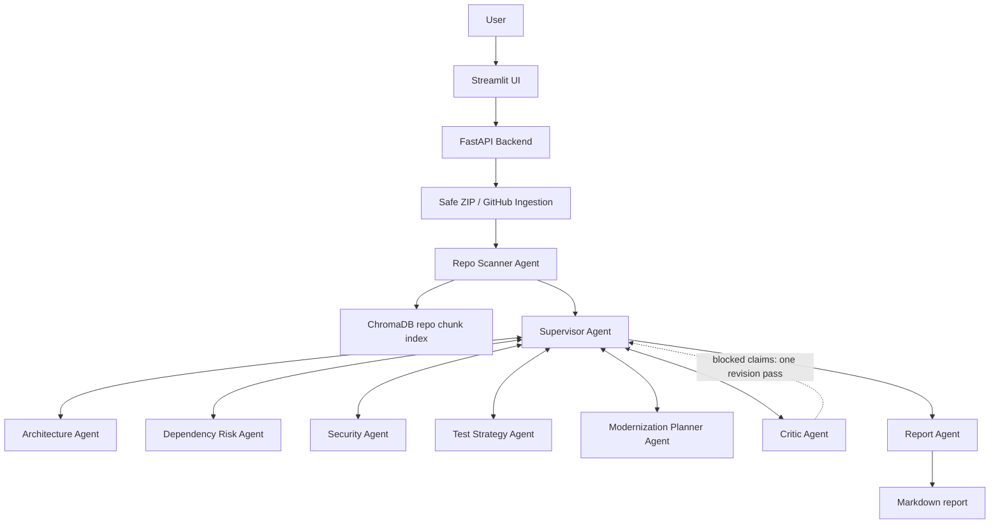

# ModernizeAI - Multi-Agent Legacy Modernization Platform

ModernizeAI is a multi-agent legacy application modernization assistant. A user uploads a Java/Spring Boot or Node.js repository zip, or enters a public GitHub repository URL, and the system produces an evidence-backed modernization report.

ModernizeAI performs static analysis only. It does not execute uploaded code, install dependencies, deploy applications, delete files, or perform migrations. All recommendations require human review.

## Product Access

- Live application: http://54.163.36.36:8501/
- Recorded walkthrough: [ModernizeAI walkthrough](https://drive.google.com/file/d/1YoyNk1DG_VS0L5P9ZkG4oXeqxwoDeHM8/view?usp=sharing)
- Public repository: https://github.com/vedant-abrol/ModernizeAI-Multi-Agent-System

## Architecture



The graph is dynamic: after repo scanning, the Supervisor selects, skips, or revisits specialist agents based on repository evidence and Critic feedback.

## Agents

- Repo Scanner Agent: deterministic repository facts, framework detection, file classification, API inventory, and vector indexing.
- Supervisor Agent: dynamically routes specialist agents, prioritizes risk signals, skips irrelevant reviews, and sends blocked claims back for one evidence-backed revision pass.
- Architecture Agent: summarizes layers, API entry points, data access, and integrations from evidence.
- Dependency Risk Agent: parses Maven, Gradle, and npm dependency files and reports modernization risk without inventing CVEs.
- Security Agent: performs deterministic pattern scans for hardcoded secrets, exposed actuator settings, plaintext HTTP integrations, wildcard CORS, disabled CSRF, debug mode, and SQL concatenation patterns.
- Test Strategy Agent: identifies likely missing controller and service tests without claiming coverage percentages.
- Modernization Planner Agent: creates a phased AWS/cloud modernization roadmap and candidate service boundaries backed by files.
- Critic Agent: blocks unsupported claims and verifies that security findings and service candidates include evidence.
- Report Agent: renders the final Markdown report with an evidence appendix.

## Guardrails

- Uploaded repositories are treated as untrusted input.
- ZIP extraction prevents path traversal and skips suspicious binary/script extensions.
- Repository code is never executed.
- Secrets are redacted before indexing and report generation.
- Dependency findings are modernization risks unless a real vulnerability scanner is integrated.
- Microservice boundaries are candidates, not automatic refactoring instructions.
- Bedrock agent output is expected to be strict JSON when enabled.
- GitHub URL ingestion uses the GitHub API to find the default branch and download a zipball. Public repositories work without a token; private repositories require `GITHUB_TOKEN` or `GH_TOKEN` with repository read access.

## Tech Stack

- Frontend: Streamlit
- Backend: FastAPI
- Orchestration: LangGraph graph model with a streaming-compatible executor
- LLM provider: Amazon Bedrock
- Embeddings: Amazon Titan Text Embeddings V2 with deterministic local fallback for tests and offline runs
- Vector store: ChromaDB with in-memory fallback
- Deployment: Docker Compose on AWS EC2
- Tests: Pytest

## Local Setup

```bash
python3 -m venv .venv
source .venv/bin/activate
pip install -r requirements.txt
cp .env.example .env
mkdir -p data/uploads data/repos data/reports data/chroma sample_repos
python3 scripts/create_sample_repo.py
```

Start the API:

```bash
uvicorn app.main:app --reload --port 8000
```

Start the UI in another terminal:

```bash
streamlit run frontend/streamlit_app.py --server.port 8501
```

Open `http://localhost:8501` and upload one of the generated sample repositories:

- `sample_repos/legacy-order-management-system.zip` for a compact analysis.
- `sample_repos/legacy-claims-processing-platform.zip` for a richer repository with multiple domains, CI/CD files, security findings, and stronger modernization candidates.

## Bedrock Configuration

For local development, `.env.example` keeps `MODERNIZEAI_USE_BEDROCK_AGENTS=false` so the app can produce deterministic reports before AWS credentials are connected. For an AWS-backed deployment, set:

```env
MODERNIZEAI_USE_BEDROCK_AGENTS=true
MODERNIZEAI_USE_BEDROCK_EMBEDDINGS=true
AWS_REGION=us-east-1
BEDROCK_CHAT_MODEL_ID=us.anthropic.claude-opus-4-6-v1
BEDROCK_EMBED_MODEL_ID=amazon.titan-embed-text-v2:0
MODERNIZEAI_REQUIRE_BEDROCK_AGENTS=true
```

Attach an IAM role to EC2 with Bedrock runtime permissions instead of storing access keys in `.env`.

Claude Opus 4.6 should be called through a Bedrock inference profile. For `us-east-1`, use the US geo inference profile ID. Verify the real Bedrock call path before using Bedrock-backed agents:

```bash
MODERNIZEAI_USE_BEDROCK_AGENTS=true \
BEDROCK_CHAT_MODEL_ID=us.anthropic.claude-opus-4-6-v1 \
python3 scripts/check_bedrock_nova.py
```

## Docker

```bash
cp .env.example .env
docker compose up --build
```

Open `http://localhost:8501`.

The FastAPI backend runs inside the same container as Streamlit and does not need to be exposed publicly.

## EC2 Deployment

Use an Ubuntu `t3.small` or `t3.medium` instance in `us-east-1`.

1. Enable Bedrock access for Amazon Titan Text Embeddings V2 and Anthropic Claude Opus 4.6.
2. Attach an IAM role with `bedrock:InvokeModel` and `bedrock:InvokeModelWithResponseStream`.
3. Open inbound port `8501` for approved reviewers or for the intended public review window.
4. Install Docker and clone this repo.
5. Copy `.env.example` to `.env`, set `MODERNIZEAI_USE_BEDROCK_AGENTS=true`, set `MODERNIZEAI_REQUIRE_BEDROCK_AGENTS=true`, and confirm the model IDs.
6. Run `docker compose up --build -d`.

## API

- `POST /analyze/upload`: upload repository zip.
- `POST /analyze/github`: analyze a `https://github.com/{owner}/{repo}` URL using the GitHub API. Public repositories work without a token; private repositories require `GITHUB_TOKEN` or `GH_TOKEN`.
- `GET /analysis/{analysis_id}/status`: return agent progress.
- `GET /analysis/{analysis_id}/report`: return Markdown report.
- `GET /analysis/{analysis_id}/evidence`: return scanner and agent evidence.

## Product Walkthrough

1. Open Streamlit.
2. Upload `sample_repos/legacy-claims-processing-platform.zip` for a comprehensive analysis, or `sample_repos/legacy-order-management-system.zip` for a shorter run.
3. Click Analyze Repository.
4. Show detected framework, controllers, services, repositories, security findings, missing tests, and service candidates.
5. Open the final report and evidence expander.
6. Download the Markdown report.

## Tests

```bash
pytest
```

The tests cover ZIP safety, secret redaction, scanner detection, and report generation.

## Safety and Operating Model

- ModernizeAI performs static analysis only and does not execute, build, deploy, or mutate uploaded repositories.
- Dependency findings are treated as modernization risks unless confirmed by a dedicated vulnerability scanner such as OSV.
- The live application runs as a single-instance AWS EC2 deployment with Docker Compose.
- Production hardening would add authentication, tenant isolation, managed vector storage, background job queues, and expanded audit logging.

## Reference Links

- Amazon EC2 documentation: https://docs.aws.amazon.com/ec2/
- Amazon Bedrock documentation: https://docs.aws.amazon.com/bedrock/
- Amazon Bedrock Converse API: https://docs.aws.amazon.com/bedrock/latest/userguide/conversation-inference.html
- Amazon Titan Text Embeddings: https://docs.aws.amazon.com/bedrock/latest/userguide/titan-embedding-models.html
- Amazon Bedrock pricing: https://aws.amazon.com/bedrock/pricing/
- ChromaDB Python client: https://docs.trychroma.com/reference/python/client
- LangGraph overview: https://docs.langchain.com/oss/python/langgraph/overview
